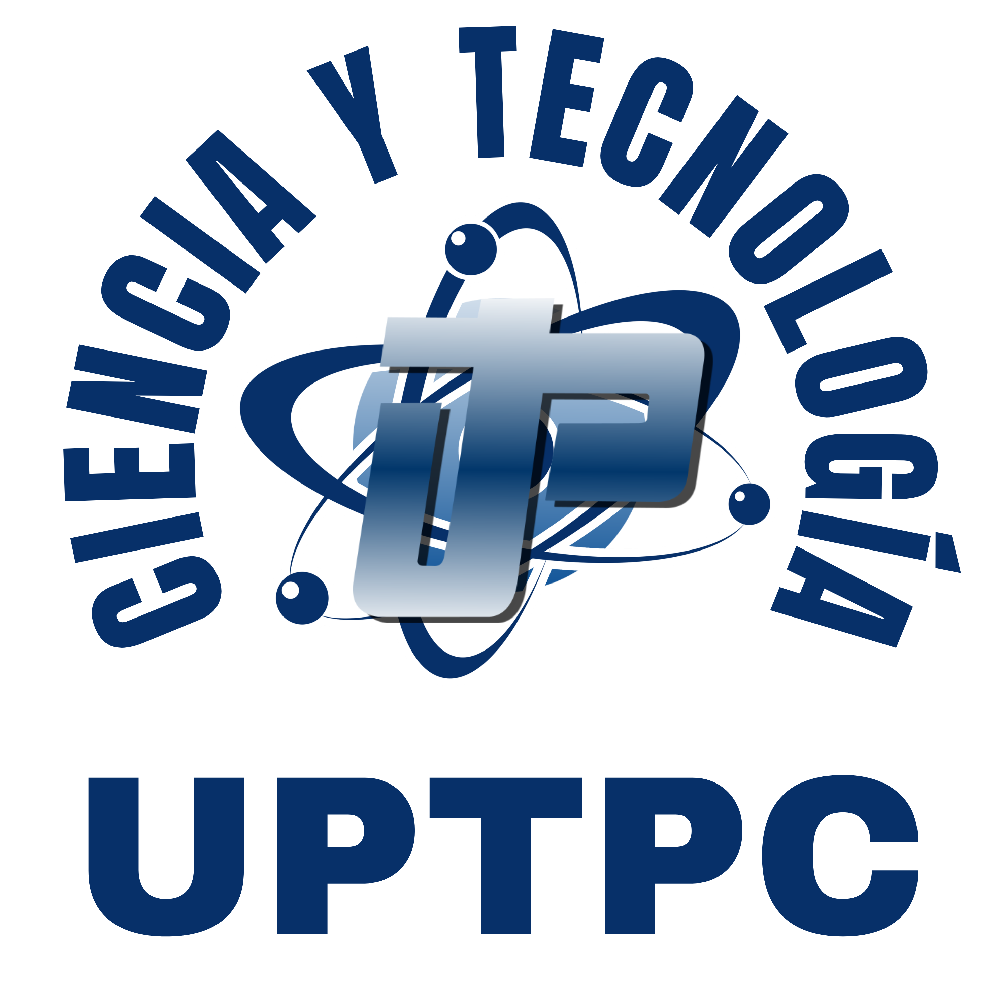

<p align="center">
  
</p>

# 🚀 Hackaton - Unidad de Ciencia y Tecnología


## 📋 Descripción general

Este repositorio contiene el desarrollo web del Hackaton de la Unidad de Ciencia y Tecnología UPTPC. El proyecto está orientado a la creación de desafíos interactivos, ejercicios técnicos y una plataforma web que organiza la experiencia del evento en años consecutivos.

El contenido está dividido en dos ediciones principales: 2025 y 2026, cada una con sus propios retos, páginas dinámicas, scripts de base de datos y recursos multimedia.

## 🎯 Objetivo del proyecto

El objetivo principal es ofrecer una experiencia de hackathon digital donde los participantes puedan:

- Explorar desafíos técnicos y retos interactivos.
- Resolver problemas mediante lógica, seguridad, debugging y programación.
- Interactuar con una plataforma web organizada por años y módulos.
- Gestionar estados, equipos, puntuaciones y tiempos mediante PHP y base de datos.

## 🛠️ Tecnologías utilizadas

- **PHP**: lógica del backend, gestión de sesiones, validación de datos y procesamiento de retos.
- **HTML/CSS/JavaScript**: estructura y experiencia visual de las páginas.
- **MySQL**: almacenamiento de información de usuarios, equipos, estados y resultados.
- **SQL**: scripts y estructuras para la base de datos del proyecto.

## 📁 Estructura del proyecto

```text
hackaton/
├── 2025/                      # Desafíos, scripts y módulos del año 2025
├── 2026/                      # Desafíos, scripts y módulos del año 2026
├── img/                       # Recursos gráficos e imágenes del proyecto
├── sql/                       # Scripts de base de datos SQL
├── index.php                  # Página principal de acceso
├── informe_habilidades.md     # Documento con información de habilidades y avances
└── README.md                  # Documentación general del proyecto
```

## 🧩 Componentes principales

### Año 2025
Contiene la primera versión del proyecto con retos, lógica de interacción y módulos iniciales del hackaton.

### Año 2026
Incluye una versión más amplia y organizada del proyecto, con desafíos más desarrollados, páginas específicas y recursos adicionales.

### Base de datos
La carpeta sql contiene los scripts necesarios para crear y mantener la estructura de datos utilizada por la plataforma.

### Recursos visuales
La carpeta img almacena imágenes y elementos gráficos usados en la interfaz del proyecto.

## ▶️ Requisitos para ejecutar el proyecto

Para trabajar con este proyecto es recomendable tener instalado:

- **PHP** con soporte para Apache o Nginx.
- **MySQL o MariaDB**.
- Un servidor local como **XAMPP**, **WAMP** o **Laragon**.
- Un navegador web moderno.

## 🚀 Cómo usarlo

1. Clonar o descargar este repositorio en el directorio del servidor web.
2. Crear la base de datos y cargar los scripts ubicados en la carpeta sql.
3. Configurar los accesos a la base de datos en los archivos de conexión correspondientes.
4. Iniciar el servidor local y abrir la página principal desde el navegador.

## 📌 Características destacadas

- ✅ Desarrollo progresivo año tras año.
- ✅ Plataforma web orientada a retos técnicos y capacitación.
- ✅ Estructura modular y organizada por ediciones.
- ✅ Integración con base de datos para controlar el estado del evento.
- ✅ Documentación adicional para seguimiento y análisis del proyecto.

---

## 👥 Créditos

Este proyecto fue desarrollado por el equipo de la Unidad de Ciencia y Tecnología.

**Héctor Marulanda**  
Programador  
Unidad de Ciencia y Tecnología

**José Herrera**  
Coordinador  
Unidad de Ciencia y Tecnología

**César Prieto**  
Rector  
UPTPC
